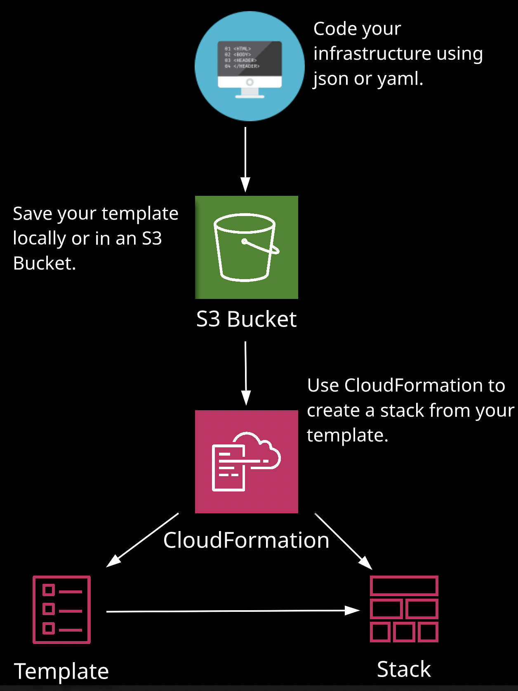
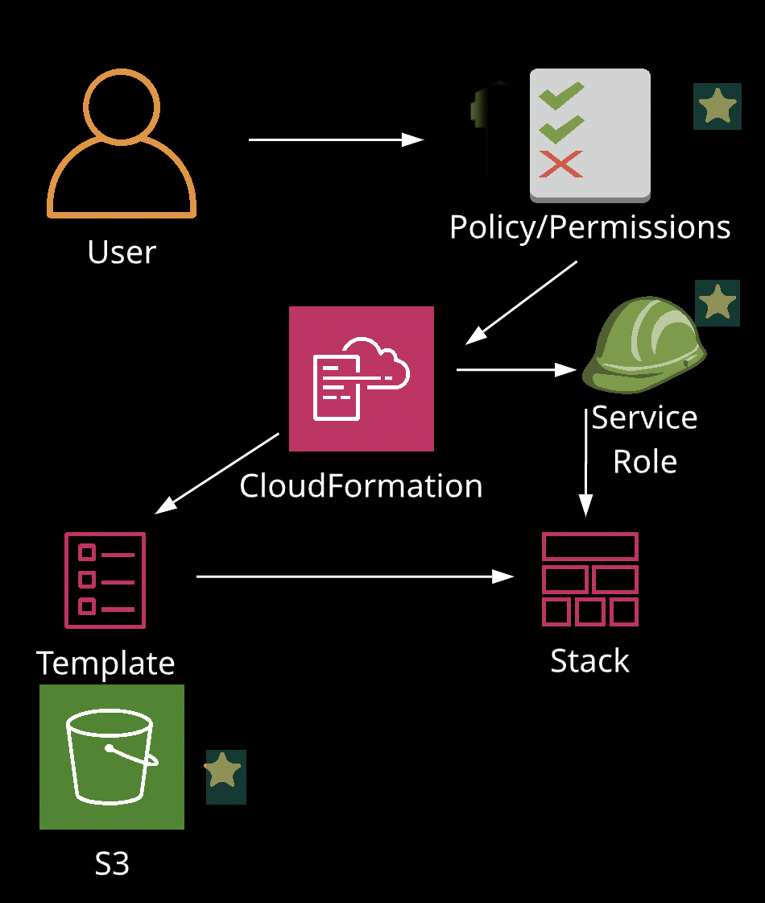

## CloudFormation Essentials 
- Infrastructure as a code

## Introduction to JSON
- Javascript Object Notation 
- Lightweight throughout AWS (CLI, IAM Policies)
- Based on Javascript, also resembles Java and C#
- Pros: Resembles popular languages and used elsewhere in AWS
- Cons: No inline comments
- can contain the null value
- Key Value Pairs - Contains data:
    ```
    "name": "Craig"
    "course": "CloudFormation Deep Dive"
    "Level": "Intermediate"
    ```
    - CloudFormation Specific Examples:
    ```
    "Type": "AWS::EC2::SecurityGroup"
    "Type": "AWS::EC2::Instance"
    ```
- Commas - Data is separates by commas
    ```
    "FirstName": "Craig", "LastName": "Arcuri", "Course": "CloudFormation Deep Dive", "Level": "Intermediate"
    ```
    - CloudFormation Example:
    ```
    "IPProtocol": "TCP", "FromPort": "80", "ToPort": "80"
    ```
- Curly Braces {} - Holds Objeects
    ```
    {
        "Name": "Craig",
        "Course": "CloudFormation Deep Dive"
    }
    ```
    - CloudFormation Example:
    ```
    {
        "Resource": {
            "HellowBucket": {
                "Type": "AWS::S3::Bucket"
            }
        }
    }
    ```
- Square Brackets [] - Holds Arrays
    ```
    [ "CloudFormation", "IAM", "DevOps Pro"]
    ```
    - Arrays can be values of an Object Property:
    ```
    "Cars": ["Ford", "BMW", "Fiat"]
    ```
    - CloudFormation Example:
    ```
    ["SubnetConfig", "VPC", "CIDR"]
    ```
## Introduction to YAML
- A data serialization language designed to be readable by humans
- a superset of JSON, you can parse JSON with a YAML Parser
- Designed for data
- Do not use tabs, use spaces
- whitespaces and lines have meaning in YAML, they are delimiters
- Pros: Much more compact than JSON, and can use inline comments
    - Ansible playbooks, Docker Compose, and Kubernetes
- Cons: Not many. it many not appeal to the javascript crowds

- Key Value Paris, contains data
    ```
    name: Craig
    course: CloudFormation Deep Dive
    Level: Intermediate
    ```
    - CloudFomration specific examples:
    ```
    Type: AWS::EC2::SecurityGroup
    Type: AWS::EC2::Instance
    ```
- What does an objeect look like?
    ```
    - finance: 12
      IT: 8
    - pre-sale: 1
      marketing: 8
    ```
- YAML Arrays can have 2 formats
    ```
    # Inline Array
    Instnae: [t2.micro, t2.small, t2.large]

    # Indented Array Instance
    Instance:
      - t2.micro
      - t2.small
      - t2.large
    ```
## Cloudformation and IAM

- Policy/Permissions **(Starting from Cloudformation)**
    - "Can my account create/modify/view/delete the Cloudformation template?"
    - Create specific policies for the CloudFormation permissions you want to grant to specific users/groups
    - Example:
        - Create a policy for users you only want to be able to view a stack
        - Create a policy for users to create, update, and delete stacks
    - Users who can create/delete stacks, must also have appropriate permissions to the resource in the stack (EC2, VPC, RDS, etc.)
- Service Role **(What Cloudformation template can do to ohter resources)**
    - Use a CF Service Role to make calls to resources in a stack on your behalf.
    - Use a Service Role to explicitly specify actions that CF can perform which might not always be the same actions you or others can perform.
- S3
    - IAM Users who use the CF console require additional permissions Uploading templates to an S3 Bucket
    - CloudFormation: CreateUploadBucket is only available from the console and requires:
        - S3: PutObject
        - S3: ListBucket
        - S3: GetObject
        - S3: CreateBucket
- How does IAM control CF Access?
    - to control what users can do with CF. 
        - Can they view Stack templates? can they create, update, and delete stacks?
    - When building stacks, you introduce a lot of different resources (VPC, IGW, EC2, Subnet, SG)
        - You need to control which service/resources the user can access with IAM
    - Specify who can terminate DBs, EC2 instance, or update other resources through IAM
    - CF should be goverend by IAM, not be an open gate for users to do anything. 
        - Practice least priviliege.
    - When you create a user or group in IAM, you can attach a policy to that user or group which specifies the permissions you want to grant for CF
- IAM Policy specifies
    - **Version**: version of the policy language
        - use the latest 2012-10-17 version
    - **Statement**: container for the following elements.
        - You can include more than one statement in a policy.
    - **Sid**: Optional ID to differentiate between statements
    - **Effect**: Allow or Deny
    - **Principal**: Indicates the account, user, role or federated user to which you would like to allow or deny access.
    - **Action**: List of actions that the policy allows or denies
    - **Resource**: List resources to which the action apply
    - **Condition(Optional)**: specify the circumstances under which the policy grants permission
## Cloudformation Resource Types
- Template
    - AWS CloudFormation is Infrastructure as Code
    - We specify our resources, such as VPC, IGW, EC2, RDS, etc.
    - But CF does not support every resource in AWS. New services are often not immdeiately supported in CF
    - What if a resource is not currently supported by CF?
        - Custom resources enable you to write custom provisioning logic in templates that CF runs anytime you create, update, and delete. 