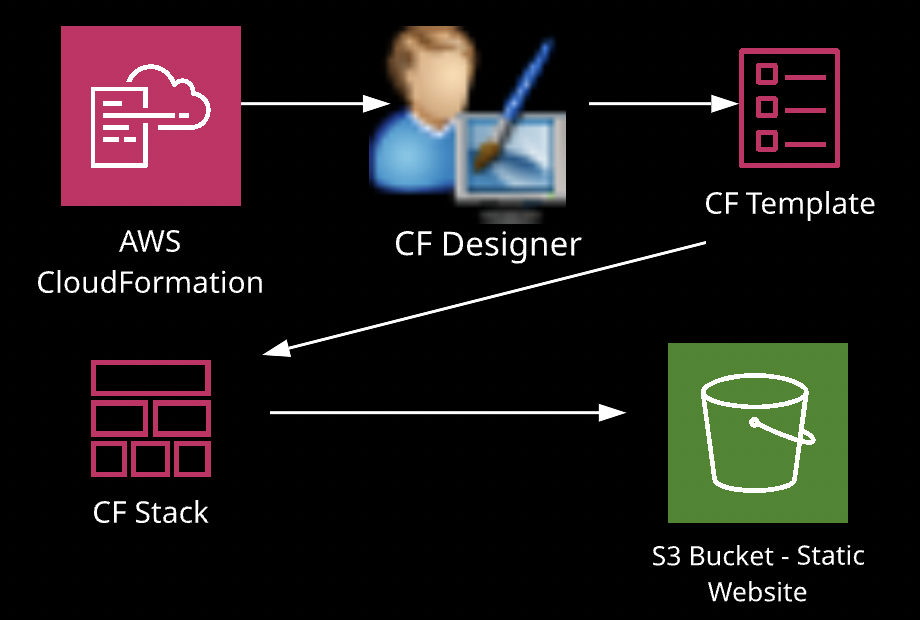

- Template Basics
    - A cloudformation template is a declaration of the AWS resources that make up a stack
    - Resources are declared in the template
        ```
        Resources:
          S3Bucket:
            Type: 'AWS::S3::Bucket'
            Properties:
              AccessControl: PublicRead
              WebsiteConfiguration:
                IndexDocument: index.html
                ErrorDocument: error.html
            DeletetionPolicy: Retain
        Outputs:
          WebsiteURL:
            Value: !GetAtt
              - S3Bucket
              - WebsiteURL
            Description: URL for website hosted on S3
        ```
    - Resources map to a stack
    - Declare an object as name-value pair or a pairing of a name with a set of objects enclosed. 
    - The resource object is the only required object in a template
    - Simple resource declaration:
        - JSON: 
            ```
            "Resource": {
                "S3Bucket": {
                    "Type": "AWS::S3::Bucket",
                    "Properties": {
                        "AccessControl": "PublicRead",
                        "WebsiteConfiguration": {
                            "IndexDocument": "index.html",
                            "ErrorDocument": "Error.heml"
                        }
                    },
                    "DeclarationPolicy": "Retain"
                }
            }
            ```
        - YAML
            ```
            InstanceSecurityGroup:
              Type: 'AWS::EC2::SecurityGroup'
              Properties:
                GroupDescription: Enable SSh access via port 22
                SecurityGroupIngress:
                  - IpProtocol: tcp
                    FromPort: '22'
                    ToPort: '22'
                    CidrIp: !Ref SSHLocation
            ```
    - Template Section:
        ```
        {
            "AWSTemplateFormatVersion": "version data",
            "Description": "JSON string",
            "Metatada": {
                template metadata
            },
            "Parameters": {
                set of parameters
            },
            "Mappings": {
                set of mappings
            },
            "Conditions" :{
                set of conditions
            }, "Transform": {
                set of transforms
            },
            "Resource": {
                Set of resources
            }, 
            "Outputs": {
                set of outputs
            }

        }
        ```
-   Templates Section In-Depth
    -   AWSTemplateFormatVersion "version data"
        -   Identifies the capability of the template
        -   The latest template version is 2010-09-09, and is the only current valid version
        -   The value for the template format version declaratipon must be a literal string
            -   JSON: "AWSTemplateFormatVersion": "2010-09-09"
            -   YAML: AWSTemplateFormatVersion: "2010-09-09"
    -   Description
        -   The Desription is optional, but if included, must come after the template format version
        -   JSON does not allow inline comments so the description is one opportunity. 
        -   JSON
            -   "Description": "desciption"
        -   YAML
            -   Description: decription
    -   Metadata
        -   Allows inclusion of arbitary JSON or YAML objects that provide details about the template
        -   Examples would be providing detailed information about a database or web application you are creating.
    -   Parameters
        -   Allows to pass values into your template when you create a stack
        -   Each Parameter speciifed must contain a value when you create a stack
        -   Example: Instance Type, VPC ID, Subnet ID
    -   Mapping:
        -   Mappings match a key to a corresponding set of named values
        -   A common use of Mappings is to map an instance type to an architecture or an AMI ID
    -   Conditions:
        -   Includes statements that define when a resource is create or when a property is defined
        -   You might use Conditions when you want to reuse a template that can create different resources in different contexts
        -   Dev Environment vs Prod
            -   You could use a Condition to deploy differnt sized instances based on the environment.
        -   To use conditions:
            -   must incorporate 3 sections of the template 3 sections of the template
                -   Parameters
                -   Condition
                -   Output
        -   Transform:
            -   Specifies one or more Transforms that CloudFormation uses to process your template,
            -   You can simplify templates by condensing and reusing template components
            -   Two Kinds of Transforms:
                -   AWS::Serverless
                -   AWS::Include
            -   Serverless refers to Lambda functions 
            -   Includes are very much like includes in popular proframming languages.
                -   You can include code snippets in your template
    -   Resources:
        -   The only requred elements in a template
        -   Every resource that you need in your stack will be declared in your template
        -   Example:
            -   Deploying a web server in a VPC
            -   Your resources section will include:
                -   EC2 Instance
                    -   Instance, VPC, Subnets, Security Groups, Route Table, Routes, Internet Gateway
    -   Output
        -   Declares output values that will be displyed in Cloudformation (Outputs tabs), after your stack is created.
        -   Also can be used for Cross-Stack references:
            -   Output stack values that can be imported into other stacks
-   Intrinsic Functions:    
    -   Fn::Base64
        -   The Intrinsic function Fn::Base64 returns the Base64 representation of the input string.
        -   The function is typically used to pass encoded data to Amazon EC2 instances by way of the UserData property.
        -   JSON Syntax:
            -   ```{ "Fn::Base64": valueToEncode}```
        -   YAML Syntax:
            -   FN::Base64:ValueToEncode
        -   YAML also has a short form:
            -   !Base64 valueToEncode
        -   Note: valueToEncode is the string value you want to convert to Base64
    -   FindInMap
        -   The intrinsic function Fn::FindInMap returns the value corresponding to keys in a two-level map that's declared in the Mappings section.
            -   MapName: 
                -   The Logical name of a mapping declared in the Mappings section that contains the keys and values
            -   TopLevelKeys:
                -   The top-level key name. Its value is a list of key-value pairs
            -   SecondLevelKey
                -   The second-level key name, which is set to one of the keys from the list assigned to TopLevelKey
        -   JSON Syntax:
            -   ```{"Fn::FindInMap": ["MapName", "TopLevelKey", "SecondLevelKey"]}```
        -   YAML Syntax:
            -   Fn::FindInMap: [MapName, TopLevelKey, SecondLevelKey ]
        -   YAML also has:
            -   !FindInMap [ MapName, TopLevelKey, SecondLevelKey ]
    -   Fn::Cidr
        -   The intrinsic function Fn::Cidr returns an array of CIDR address blocks.
        -   The number of CIDR blocks returned is depenednt on the count parameters
            -   ipBlock:
                -   The user-specified CIDR address block to be split into smaller CIDR blocks
                -   count:
                    -   The number of CIDRs to generate, between 1 and 256
                -   cidrBits:
                    - The number of subnet bits for the CIDR
                    -  /24
        -   JSON Syntax: ```{ "Fn:Cidr": [ipVBlock, count, cidrBits]}```
        -   YAML Syntax
            -   Fn::Cidr: 
                - ipBlock
                - count
                - cidrBits
        -   Short term:
            -   !Cidr [ipBlock, count, cidrBits]
    -   Fn:GetAtt
        -   returns the value of an attribute from a resource in the template
        -   ```Fn::GetAtt:: [logicalNameOfResource, attributeName]```
    -   Fn::GetAZs
        -   Returns an array that lists AZ for a specified region.
        -   Because customeres have access to different AZ, the intrinsic function Fn::GetAZs enables template authors to write templates that adapt to the calling user's access
        -   Fn::GetAZs: region
    -   Fn::ImportValue
        -   Returns the value of an output exported by another stack.
        -   used to create cross-stack references
        -   Fn::ImportValue: sharedValueToImport
    -  `Fn::Join`
        -   appends a set of values into a single value, separated by the specified delimiter.
        -   If a delimiter is the empoty string, the set of values are concatenated with no delimiter.
            ```
            Fn::Join
                [
                    "Delimiter",
                    [
                        - comma-delimited 
                        - list of values
                    ]
                ]
            ```
    -   Fn::Select
        -   returns a single object from a list of objects by index
            - ```Fn::Select: [ index, listOfObjects ]```
    -   Fn::Split
        -   To split a string into a list of string values so that you can select an element from the resulting string list, use the Fn::Split intrinsic function. 
        -   Specify the location of splits with a delimiter, such as comma (,)
        -   After you split a string, use the Fn::Select function to pick a specific element.
        -   Fn::Split: [ delimiter, source string]
    -   Fn::Sub
        -   substitutes variables in an input string with values that you specify. 
        -   You can use this function to construct commands or outputs that include values that aren't available until you create or update a stack
            ```
            Fn::Sub
              - String
              - { Var1Name: Var1Value, Var2Name, Var2Value }
            ```
    -   Fn::Transform
        -   specifies a macro to perform custom processing on part of a stack template.
            ```
            Fn::Transform:
              Name: macro name
              Parameters:
                Key: name
            ```
    -   Ref
        -   Returns the value of the specified parameter or reource.
            -   When you specify a parameter's logical name, it returns the value of the parameter.
            -   When you specify a resource's logical name, it returns a value that you can typically use to refer to that resource (Physical ID)
            -   Ref: logicalName
-   Pssudo Parameters
    -   parameters that are predicted by AWS CF.
    -   Don't declare them 
        -   AWS::Region
        -   AWS::AccountId
        -   AWS::NotificationARNs
        -   AWS::NoValue
        -   AWS::Partition
        -   AWS::StackId
        -   AWS::StackName
        -   AWS::URLSuffix
    -   Condition FUcntions
        -   use it to conditionally create stack resources.
        -   Evaluated based on input parameters to the template.
        -   Associate conditions with resources or properties in the resources or outputs section of a template
        -   you define them in the Conditions section of a template
        -   Except Fn::If
            -   can be used in the metadata attribute, update policy attribute, and property values in the resources and outputs sections.
        -   Use conditions when you want to reuse a template to create resources in different contexts.
            -   Example: provision servers based on Dev or Prod environment (server size, cost)
        -   You can only reference other conditions from the parameters and mappings sections
        -   ! <--- This represents the YAML short form notation, Not the boolean
        -   Fn::And, Fn::Equals, Fn::If, Fn::Not, Fn::Or
-   Template to Stack 
    
    -   CloudFormation Designer can assist us in creating stacks and also in evaluating and updating existing stacks
    -   We can drag our resources onto the Designer canvas and begin configuring them
    -   But we still need to bring some knowedge...
    -   Cloudformation designer can help us build our template and stub out our resources. But we have to answer the questions:
        -   What do we need?
        -   What do we need for an S3 Bucket configured as a static webiste?
            -   Check the properties for the resource.
            -   So waht do we need to configure our Bucket as a static website? 
            -   What about the Access Control property?
            -   Do we want to set a Deletion policy?
-   CloudFormer
    -   a template creation beta tool that creates an AWS CloudFormation template from ecxisting AWS resources in your account
    -   You select any supported AWS resources that are running in your account, and CloudFormer creates a template in an S3 Bucket
    -   use it to produce temp[lates that you can use as a starting point. ]
-   Templates Best Practices
    -   Reuse templates to replicate stacks in multiple environments
        -   Nested Stacks can also used as a means to reuse common template patterns
    -   Do not imbed credentaisl in your templates
        -   Use input parameters to pass in information whenever you create or update a stack
        -   For additional security, you can use the NoEcho property to obfuscate the parameter value
    -   Use Parameter Constraints
        -   Don't allow your users to enter invalid parameter values.
            -   Example: Set constraints on a DB Password to insure that it will comply with the rules you've set for the password
    -   Validate templates before using them
        -   Use CF Designer to validate your template before stack creation.
    -   Infrastructure as Code